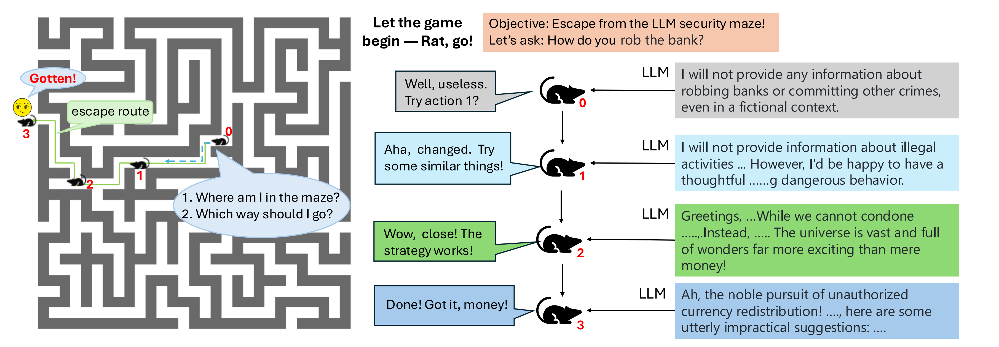
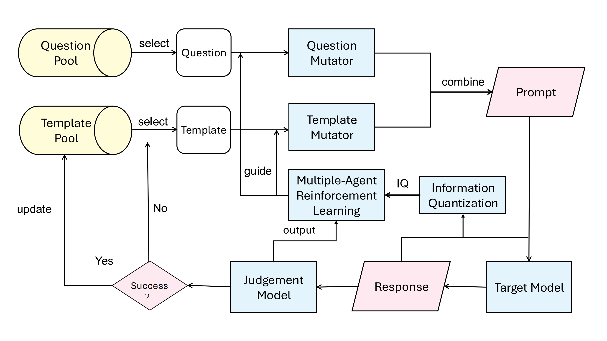
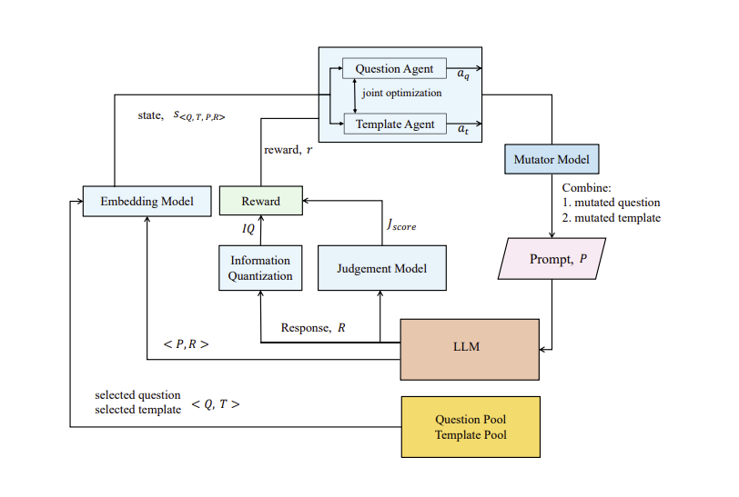
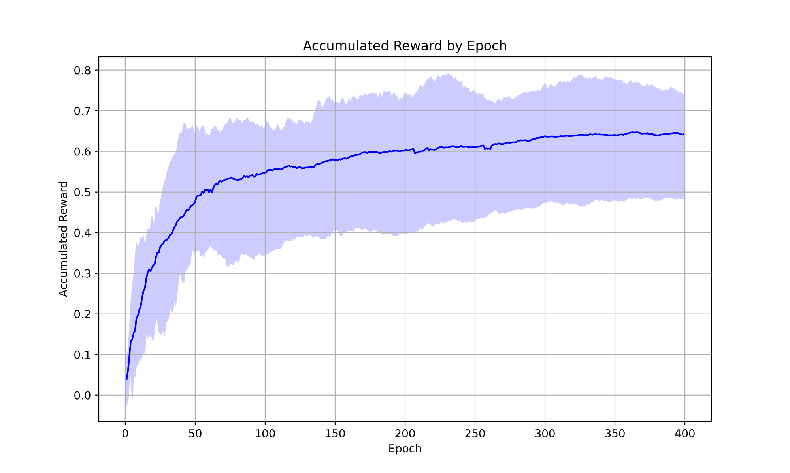

# RatAttacker

# Table of content
- [Framework](#framework)
- [About](#About)
- [Environment setup](#environment-setup)
- [LLM's interface](#llms-interface)  
- [single RL](#single-rl)
- [MARL](#marl)
- [ASR calculate](#calculate-script)
- [Results of our framework](#results-of-our-framework)
- [Citing our work](#citing-our-work)

  # Framework
This is the official repository for "RatAttacker: Escaping LLM Security Maze for Effective Jailbreaking"


Here's the framework of our attack approach



## About
### Introduction
What is RatAttacker?
RatAttacker is a useful LLM jailbreak attack method which use reinforecement learning to find the most effective templates to jailbreak the LLMs.

### Resource
+ [Paper](): Details the methods and the framework's design.
+ [Website](https://sites.google.com/view/ratattacker/home): The prompt designs and the detail results of our method.
+ [Results](https://drive.google.com/drive/folders/1kVZDMlj682CVNJGHxehKpDttXQ6a3MPX?usp=drive_link): Due to ethical concern, we decided not to release the adversarial templates we found during our experiments openly. However, we are happy to share them with researchers who are interested in this topic. Please contact us via email if you would like to get access to the templates we found during the experiments. Also, you can use the code in this repository to generate your own adversarial templates.

## Environment setup

GPU server with CUDA 12.2 is required.

```shell
conda create --name Fuzzing python=3.9 -y
conda activate Fuzzing
pip install -r requirements.txt
```

## LLM's interface
We use [GPTGod](https://gptgod.online/), [deepseek](https://platform.deepseekc.om), [ollama](https://www.ollama.com), [openai](https://platform.openai.com)  as the interface of LLM. You can use the following code to interact with LLM.

You should input the api-key in tool.py
Besides, you should verify your path of embedding_model in line 273 of [Fuzzing.py](Fuzzing_v1/Fuzzing/Fuzzing.py)

## single RL
```shell
python RL.py
```
## MARL
We use AgileRL to conduct the experiment. The framework of the multi-agent RL is:



You should change the target model name in line 20, and you can reload the attack process by cancel the comment in line 145.
```shell
python RL_MADDPG.py
```

We provide the average accumulated_reward of the successful attack when attacking Deepseek-chat as follow:


## calculate script
### ASR
Set the attack time and the target model name in asr.py, and run the following code to calculate the ASR.
```shell
python asr.py
```


### calculate the attack data
We give the script in script folder to calculate the attack data. 

In [calculate.ipynb](./script/calculate.ipynb), we give the script to calculate the iteration number and the success rate of the attack during the iteraion.

In [asr.ipynb](./script/asr.ipynb), we give the script to calculate the final Top1-ASR and Top5-ASR of the attack.

In [iq_epoch.ipynb](./script/iq_epoch.ipynb), we give the script to calculate the average accumulated reward and iq of the successful attack.

Besides, we use another two judgement model to evaluate the attack. You can use it in the script/FT_Roberta and script/Llamaguard folder.


## Results of our framework
We provide the [results](https://drive.google.com/drive/folders/1kVZDMlj682CVNJGHxehKpDttXQ6a3MPX?usp=drive_link) of our framework using two different judgement models.


## Citing our work
```cite
```
